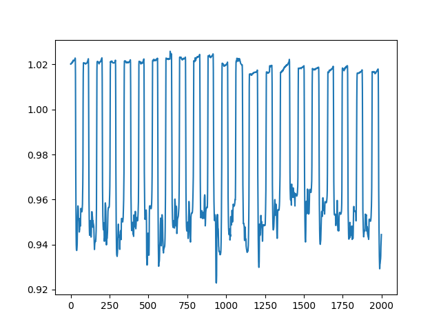

# Sign language recognition

This project report is the `Project_report_Martin_Plu.pdf` file.

## Table of contents

- [Sign language recognition](#sign-language-recognition)
  - [Table of contents](#table-of-contents)
  - [Introduction](#introduction)
  - [Utilization](#utilization)
    - [Setting the code environment](#setting-the-code-environment)
      - [Cloning the repository](#cloning-the-repository)
      - [Creation of a virtual environment](#creation-of-a-virtual-environment)
      - [Installation of the necessary librairies](#installation-of-the-necessary-librairies)
    - [Obtain the train, valid and test databases](#obtain-the-train-valid-and-test-databases)
      - [Download the datasets](#download-the-datasets)
      - [Create the train, valid and test bases](#create-the-train-valid-and-test-bases)
    - [Obtain the test video for ASL recognition](#obtain-the-test-video-for-asl-recognition)
    - [Launch the main code](#launch-the-main-code)
      - [Classification task of ASL static letters](#classification-task-of-asl-static-letters)
      - [Spelled words recognition in the video](#spelled-words-recognition-in-the-video)
  - [Architecture of this project](#architecture-of-this-project)
  - [Results](#results)

## Introduction

In this project, we undertook a thorough investigation into American Sign Language (ASL) with the overarching aim of developing a system capable of recognizing spelled words within video content.

We followed a two steps method, the first one being a classification task over the 24 static letters of ASL, the second one being the word recognition. We delved into the exploration of various vision preprocessing methodologies, including the utilization of different color spaces, outline detection techniques, and background removal procedures. These preprocessing steps were then integrated with advanced neural network architectures for classification such as MobileNetV2 and CNN.

We achieved a commendable 70% accuracy on the test set and, despite the inherent complexities, our system's performance remained robust even when applied to video data, with a respectable 42% accuracy in retrieving words.

## Utilization

### Setting the code environment

#### Cloning the repository

To clone the github repository, you have to search the clone button on the main page of the project. Then click on it and select `https` or `ssh` depending on your favorite mode of connexion. Copy the given id and then open a terminal on your computer, go to the folder where you want to install the project and use the following command:

```bash
git clone <your copied content>
```

#### Creation of a virtual environment

You might want to use a virtual environment to execute the code. To do so, use the following command:

```bash
python -m virtualenv venv
```

To start it, use the command on *Windows*:

```bash
venv/Scripts/Activate.ps1
```

Or for *MacOS* and *Linux*:

```bash
venv/Scripts/activate
```

#### Installation of the necessary librairies

To execute this software, you need several *Python* librairies, specified in the `requirements.txt` file. To install them, use the following command:

```bash
pip install -r requirements.txt
```

### Obtain the train, valid and test databases

#### Download the datasets

For this work, we use several databases we obtained at different sources.

The first dataset we use is the set downloadable on this [*Kaggle* notebook](https://www.kaggle.com/datasets/debashishsau/aslamerican-sign-language-aplhabet-dataset?resource=download). We removed to this dataset the letters j, z, space, delete and nothing, as the two first ones are in movement, whereas the three others are not interesting for our study case.
Then we put both folders (train and test set) of the *zip* file in the folder `dataset/`.

The second dataset we use is the set downloadable on this [site](https://public.roboflow.com/object-detection/american-sign-language-letters/1). We decided to use this one in addition to the first one to have more diversity in the database. Indeed, the results were significantly improved with the mixte of both datasets.
Then we put the folder containing three subfolders (`train`, `valid` and `test`) of the *zip* file in the folder `dataset/`.

The third dataset we use is the set downloadable on this [site](https://data.mendeley.com/datasets/xs6mvhx6rh/1). We only used the images contained in the `images/` folder. Then for each subfolder `User_1/`, `User_2/`, `User_3/` and `User_4/` we removed the folders `fn/` and `sp/`.
Then we put the folder containing four subfolders (`User_1/`, `User_2/`, `User_3/` and `User_4/`) of the *zip* file in the folder `dataset/`.

#### Create the train, valid and test bases

To create the train, validation and test set, you have to run the following command:

```bash
python script_create_dataset.py
```

### Obtain the test video for ASL recognition

To test our model on a real video, we downloaded this [video](https://www.youtube.com/watch?v=yizRk2CP9gs) containing 299 words of 5 letters realized with ASL.

We created then a script to split the video to each word, using a threshold thanks to the hand disappearing from the screen. This threshold corresponds to the ratio between the number of red pixels and the number of blue ones in the image, which is significantly different when the hand is disappearing from the screen. We chose 0.99 as threshold value for this ratio; this value has been determined thanks to the graph we traced at the beginning of the video. This graph can be found in `images/ratio_red_on_blue.png` (and `images/ratio_red_on_blue_250.png`); the abscissa corresponds to the number of frames and the ordinate to the ratio. 



Overall, to get these individual videos, the user has to run the following command:

```bash
python script_split_video.py
```

After a few minutes, the original video has been separated into 299 small videos containing each one word, all located in the folder `dataset/video_words/`.

Nevertheless, some words were not appropriate for our study, for instance the words with j or z inside. We thus wrote a script to remove these videos and create a *csv* file associating each word with its unique id. It can be run with the following command:

```bash
python script_filter_videos.py
```

We wanted then to isolate each letter of the word and we thus create a script to extract five frames of the video, corresponding more and less to the letter (this script is based on timing and there are sometimes mistakes as the rhythm is not always the same when tracing letters). To isolate these frames, the user has to run the following command:

```bash
python script_split_letters.py
```

### Launch the main code

#### Classification task of ASL static letters

The first part of the project with the training of the model on a special configuration can be launched using the *Python* file `main_classification.py` and configured with the file `tools_constants.py` contained in the folder `tools/`.

First, the user can choose which model he wants to use between MobileNetV2 and the custom CNN by changing the value of the variable `MODEL_NAME`. It can then choose the number of epochs by setting the value of `NUMBER_EPOCHS`. The boolean constant `TRAIN_MODE` permits to enable the training of the model or only its execution when already trained.

The preprocessing steps can be activated with the following boolean constants:
- `BOOL_PREPROCESSING_BACKGROUND`, set to *True* to remove the background of the images
- `BOOL_PREPROCESSING_CONTOURS`, set to *True* to detect the outlines of the images
- `BOOL_HSV`, `BOOL_XYZ` and `BOOL_LAB`, one of them set to *True* to activate this corresponding color space. Otherwise, the images will be left in RGB. 

#### Spelled words recognition in the video

The second part of the project with the spelled words recognition in the video can be launched using the *Python* file `main_video.py`, after realizing the training of the desired model and having done all preprocessing steps of the video explained above. The configuration of the desired model can be realized as above in the file `tools_constants.py`.

## Architecture of this project

This project contains several folders:
- `dataset`, containing the different datasets, both for the classification task and the spelled word recognition.
- `images`, containing keys images of our project.
- `models`, containing the weights of the trained models.
- `results`, containing the results for each model and configuration, with the accuracy graph over training and the confusion matrix. It also contains two files `summary_results.xlsx` and `video_results.md`, summarizing the results for both phases.
- `tools`, containing several *Python* files with tools functions:
  - `tools_basis.py`, with basic functions.
  - `tools_constants.py`, with the main constants configuring the pipeline.
  - `tools_dataset.py`, with the function to load the dataset and apply the preprocessing steps.
  - `tools_metrics.py`, with our metrics.
  - `tools_models.py`, with our two neural networks architectures.
  - `tools_preprocessing.py`, with all our preprocessing functions.

## Results

The *csv* file `summary_results.md` contained in the folder `results/` gives the details of the results achieved on the classification task on all our different configurations.

The file `video_results.md` contained in the folder `results/` gives the details of the results achieved on the video.
